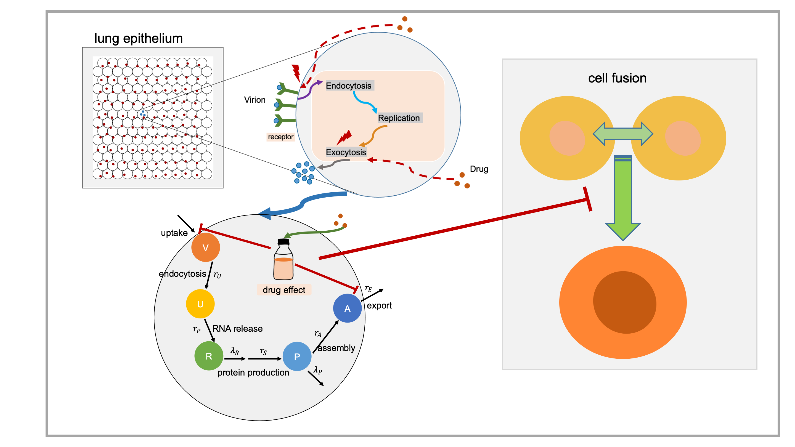

# COVID19 pharmacodynamics-submodel
This model simulates the COVID19 pharmacodynamics response. See https://github.com/pc4covid19/COVID19 for full model information.\
To model the single-cell pharmacodynamics, we first modeled the rate of drug internalization as diffusion through the cell membrane, allowing us to track the accumulated total drug in each cell. Then, we model the total effect E for each cell based on the internal drug concentration using a Hill function. The effect is then used to modulate a vector r of cell parameters from their untreated rates r_0 to their rates at maximum drug efficacy r_max when E  = Emax. In this investigation, r includes the ACE2 dynamics, viral replication (optional) and export rate. We also modified the epithelium dynamics submodel to simulate `cell fusion` process since `version 0.3.0`. In addition, we can model the impact of partial drug efficacy by multiplying the effect by a sensitivity S, where S = 0 denotes a drug with no efficacy (e.g., it fails to bind its target), and S = 100% is an idea drug that fully binds and inhibits its target. See the model diagram as following:
<p align="center">

</p>

You can try to run our cloud-hosted nanoHUB app for fun! \
https://nanohub.org/tools/virion2pbpd

### Citation
If you use the code in your work, please cite [Maraviroc inhibits SARS-CoV-2 multiplication and s-protein mediated cell fusion in cell culture](https://doi.org/10.1101/2020.08.12.246389) and [Rapid community-driven development of a SARS-CoV-2 tissue simulator](https://doi.org/10.1101/2020.04.02.019075).
```text
@article {Risner2020.08.12.246389,
	author = {Risner, Kenneth H. and Tieu, Katie V. and Wang, Yafei and Bakovic, Allison and Alem, Farhang and Bhalla, Nishank and Nathan, Steven and Conway, Daniel E. and Macklin, Paul and Narayanan, Aarthi},
	title = {Maraviroc inhibits SARS-CoV-2 multiplication and s-protein mediated cell fusion in cell culture},
	elocation-id = {2020.08.12.246389},
	year = {2020},
	doi = {10.1101/2020.08.12.246389},
	publisher = {Cold Spring Harbor Laboratory},
	journal = {bioRxiv}}
	
@article {Getz2020.04.02.019075,
	author = {Getz, Michael and Wang, Yafei and An, Gary and Becker, Andrew and Cockrell, Chase and Collier, Nicholson and Craig, Morgan and Davis, Courtney L. and Faeder, James and Versypt, Ashlee N. Ford and Gianlupi, Juliano F. and Glazier, James A. and Hamis, Sara and Heiland, Randy and Hillen, Thomas and Hou, Dennis and Islam, Mohammad Aminul and Jenner, Adrianne and Kurtoglu, Furkan and Liu, Bing and Macfarlane, Fiona and Maygrundter, Pablo and Morel, Penelope A and Narayanan, Aarthi and Ozik, Jonathan and Pienaar, Elsje and Rangamani, Padmini and Shoemaker, Jason Edward and Smith, Amber M. and Macklin, Paul},
	title = {Rapid community-driven development of a SARS-CoV-2 tissue simulator},
	elocation-id = {2020.04.02.019075},
	year = {2020},
	doi = {10.1101/2020.04.02.019075},
	journal = {bioRxiv}}
```

* * * 

## Release summary:
### 0.1.0:
This is initial release. 

### 0.2.0:
* Use intracellular drug concentration in calculating drug effect
* Update receptor dynamics, replication dynamics, export rate parameters and EC_50 to match with experimental data
* Add negative feedback for ACE2 binding, endocytosis process
* Pick up 3000 cells randomly binded with virion, rather than internalization in the beginning 
* Use Dirichlet nodes for all voxels in the simulation

### 0.3.0:
Add model of cell fusion process:
* **The conditions for cell fusion**: 
  * population of intracellular assembled virion is greater than a threshold
  * distance of two potential fused cells is smaller than a threshold
  * frequency of cell fusion is smaller than a threshold (in case a cell can become fused many times)
  * randomly sampled probability is smaller than the probability of cell fusion (which is positively corrected with the population of intracellular assembled virion)
* **If cell fusion happened, then**:
  * new fused cell’s position is the mean of two cells
  * new fused cell’s volume will be updated
  * population of ACE2 as well as intracellular virion will be updated
  * new fused cell’s intracellular virion can replicate faster (with increasing uncoating RNA and protein synthesis rates). In addition, fused cell also has larger viral tolerant capability (with increasing half of maximum apoptosis rate).
* **The effect of drug on cell fusion and virial spread**:
  * drug only inhibits cell fusion (through reduce the probability of cell fusion)
  * drug only inhibits endocytosis and exocytosis
  * drug inhibits both cell fusion, and endocytosis, exocytosis


